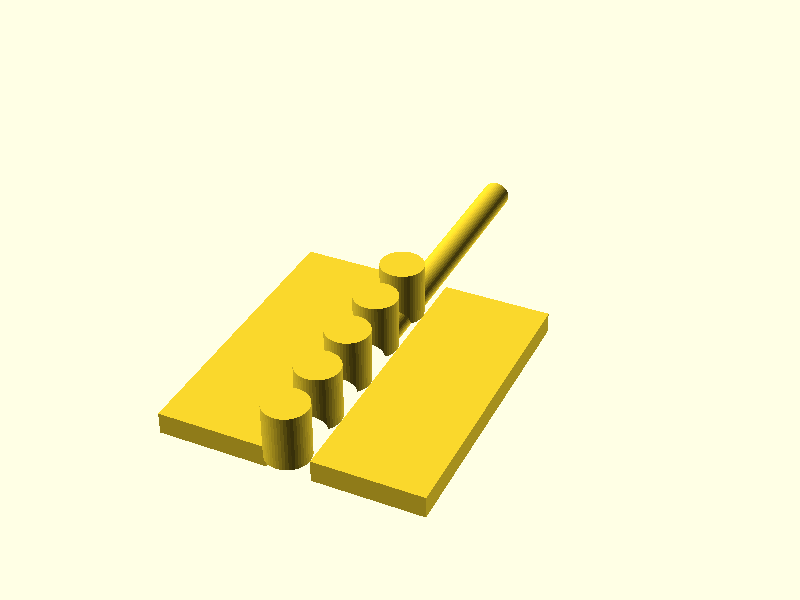
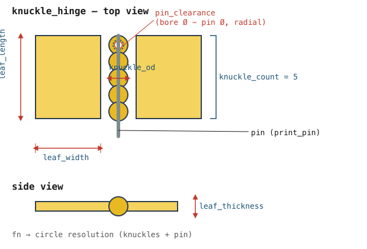
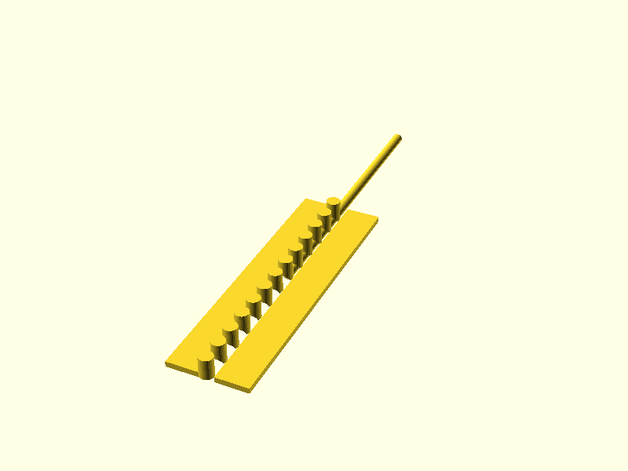
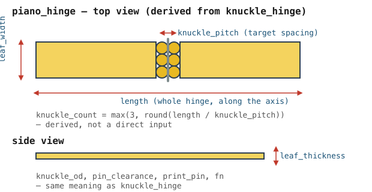
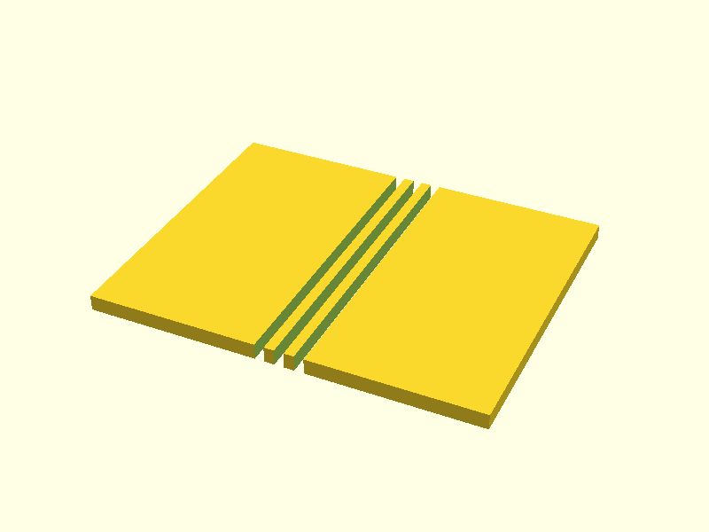
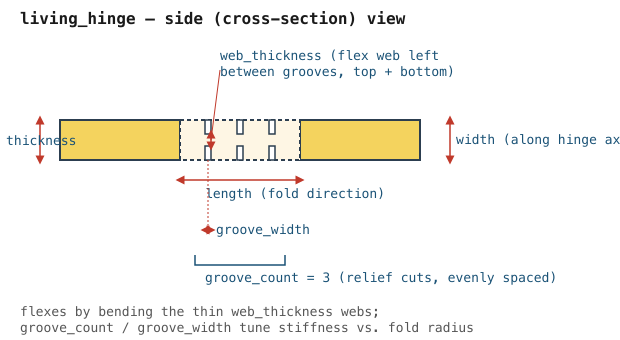
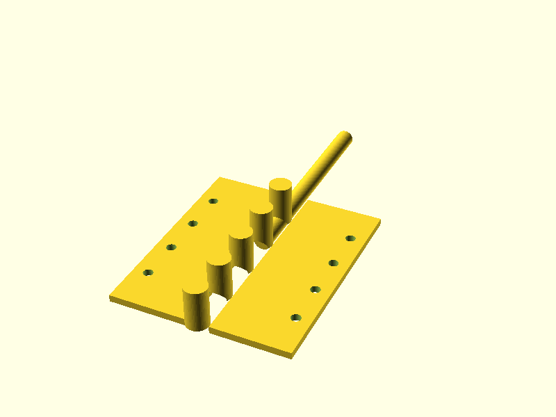
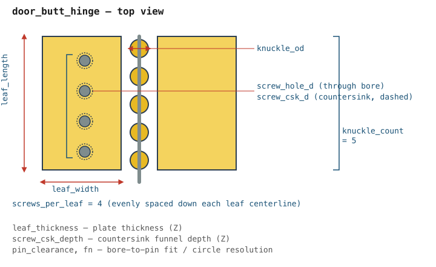
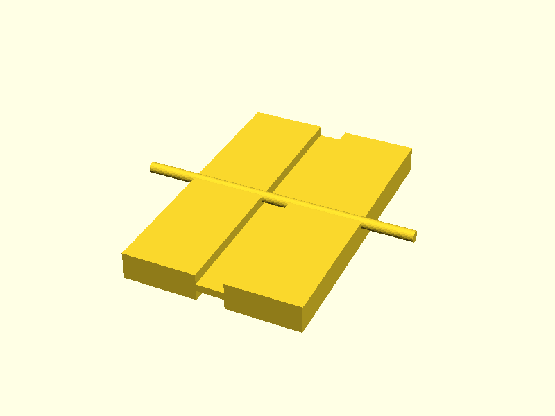
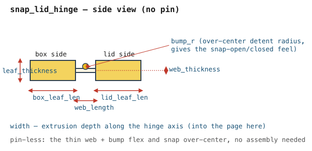

# OpenSCAD_hinge

Parametric hinge library, plain OpenSCAD (no `BOSL2`, no third-party `include`s), for boxes,
lids, and wooden doors/cabinets. Loadable standalone in real OpenSCAD and by
[OpenSCAD-gui](../OpenSCAD-gui) (a custom JS OpenSCAD engine that resolves `include`/`use`
against its own drag-drop file provider and does not bundle BOSL2).

All modules live in `hinge_library.scad`. Each hinge type has a demo file under `examples/`
and a rendered preview under `renders/`.

## Usage

```openscad
include <hinge_library.scad>

knuckle_hinge(leaf_length=40, leaf_width=15, leaf_thickness=3, knuckle_od=6, knuckle_count=5);
```

Hinge axis convention: the barrel/knuckle axis runs along **Y**; the hinge lies flat (closed)
in the XY plane at **Z=0**. Leaf 1 occupies X<0, leaf 2 occupies X≥0, so each leaf can be
positioned/differenced directly onto its mating part. Units are mm.

---

## knuckle_hinge — print-in-place box lid hinge

Interleaved barrel knuckles across two leaves, joined by a separate pin. General-purpose,
works for any box/lid split line.




| Parameter | Default | Meaning |
|---|---|---|
| `leaf_length` | 40 | Hinge length along the axis (Y) |
| `leaf_width` | 15 | Depth of each leaf plate (X), per leaf |
| `leaf_thickness` | 3 | Leaf plate thickness (Z) |
| `knuckle_od` | 6 | Knuckle/barrel outer diameter |
| `knuckle_count` | 5 | Number of knuckles across both leaves (odd = symmetric ends) |
| `pin_clearance` | 0.25 | Radial clearance between pin and knuckle bore |
| `print_pin` | true | Include the pin as a separate free solid, offset for printing |
| `include_leaves` | true | Set false to get knuckles + pin only (caller supplies its own leaves — used by `door_butt_hinge`) |
| `fn` | 48 | `$fn`-style circle resolution for knuckles and pin |

---

## piano_hinge — continuous knuckle hinge, cut to any length

Same knuckle geometry as `knuckle_hinge`, but knuckle count is derived from `length` and a
target `knuckle_pitch`, for long lids needing even load distribution.




| Parameter | Default | Meaning |
|---|---|---|
| `length` | 100 | Total hinge length along the axis |
| `leaf_width` | 12 | Depth of each leaf plate |
| `leaf_thickness` | 2 | Leaf plate thickness |
| `knuckle_od` | 5 | Knuckle outer diameter |
| `knuckle_pitch` | 8 | Target spacing between knuckle centers — `knuckle_count = max(3, round(length / knuckle_pitch))`, not set directly |
| `pin_clearance` | 0.25 | Radial clearance between pin and bore |
| `print_pin` | true | Include the pin as a separate free solid |
| `fn` | 32 | Circle resolution |

---

## living_hinge — flexible groove-cut strip hinge

Thin-wall, print-in-place fold hinge: parallel relief grooves cut from both faces leave a
thin flexible web that folds without a pin or assembly.




| Parameter | Default | Meaning |
|---|---|---|
| `width` | 40 | Extent along the hinge axis (Y) |
| `length` | 10 | Extent across the fold direction (X) |
| `thickness` | 2 | Parent wall thickness either side of the hinge |
| `web_thickness` | 0.6 | Thickness of the flexible web left after each groove cut |
| `groove_count` | 3 | Number of parallel relief grooves |
| `groove_width` | 1.2 | Width of each groove cut |

---

## door_butt_hinge — traditional mortise-plate hinge for wooden doors/cabinets

Hardware-pattern butt hinge: flat leaves, a knuckle barrel (built on `knuckle_hinge` with
`include_leaves=false`), and countersunk screw holes down each leaf centerline. Model to spec
for routing a mortise, or print directly in a rigid filament.




| Parameter | Default | Meaning |
|---|---|---|
| `leaf_length` | 76 | Hinge length (e.g. 76mm ≈ a 3" hinge) |
| `leaf_width` | 28 | Depth of each leaf plate |
| `leaf_thickness` | 2.5 | Leaf plate thickness |
| `knuckle_od` | 8 | Knuckle outer diameter |
| `knuckle_count` | 5 | Number of knuckles |
| `screw_hole_d` | 3.5 | Screw through-hole diameter |
| `screw_csk_d` | 6.5 | Countersink diameter |
| `screw_csk_depth` | 1.5 | Countersink funnel depth |
| `screws_per_leaf` | 4 | Screw holes per leaf, evenly spaced down the centerline |
| `pin_clearance` | 0.3 | Radial clearance between pin and bore |
| `fn` | 48 | Circle resolution |

---

## snap_lid_hinge — pin-less friction/snap hinge for box lids

A thinned flex web plus an over-center detent bump, so a lid snaps open/closed without a pin
or any assembly step.




| Parameter | Default | Meaning |
|---|---|---|
| `width` | 30 | Extrusion depth along the hinge axis |
| `box_leaf_len` | 8 | Leaf length printed/glued into the box wall |
| `lid_leaf_len` | 8 | Leaf length printed/glued into the lid wall |
| `leaf_thickness` | 3 | Leaf thickness |
| `web_length` | 3 | Flex web length between the two leaves |
| `web_thickness` | 0.8 | Flex web thickness |
| `bump_r` | 0.6 | Over-center detent bump radius, gives the snap feel |

---

## Regenerating previews

```sh
openscad -o renders/<name>.png --imgsize=800,600 --autocenter --viewall examples/<name>_demo.scad
```

Schematics are hand-authored SVGs in `schematics/`, rasterized with `rsvg-convert -o out.png in.svg`.
